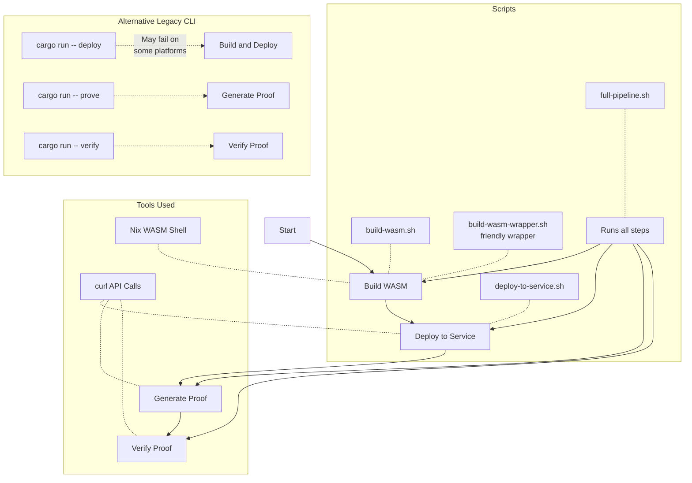

# Valence Co-processor App

This is a template for a Valence co-processor application that uses SP1 zkVM technology.

## Project Structure

#### `./core`

The primary definition with common functionality shared between the circuit and the library. Its separation from both the library and circuit definitions facilitates easier unit testing.

#### `./lib`

The library deployed onto the Registry VM, containing pre-built functions like "get_witnesses" and "entrypoint".

#### `./zkvm`

The circuit specification to be proven by the zkVM for generating a verifiable proof, along with the transition function.

#### `./script`

A CLI application acting as a helper for deployment, proving, and verification.

#### `./scripts`

Shell scripts for building, deploying, and testing the application.

## Cargo CLI Approach

Alternatively, you can try the original Cargo approach (though it may not work on all platforms due to dependency issues):

```sh
# Build and deploy using the Cargo command (may fail on some platforms)
cargo run --manifest-path script/Cargo.toml -- deploy

# Generate a proof
echo '{"name": "Valence"}' | cargo run --manifest-path script/Cargo.toml -- prove 

# Verify a proof
echo '{"name": "Valence"}' | cargo run --manifest-path script/Cargo.toml -- prove | cargo run --manifest-path script/Cargo.toml -- verify
```


## Requirements for Manual Install

If you prefer to set up the environment manually without Nix, you'll need the following components:

- [Rust](https://www.rust-lang.org/tools/install)

```sh
curl --proto '=https' --tlsv1.2 -sSf https://sh.rustup.rs | sh
```

- WASM toolchain

```sh
rustup target add wasm32-unknown-unknown
```

- [clang and llvm](https://clang.llvm.org/get_started.html)

```sh
sudo pacman -S clang llvm
```

Note: openssl-dev might also be required.

- [SP1](https://docs.succinct.xyz/docs/sp1/getting-started/install)

```sh
curl -L https://sp1up.succinct.xyz | bash
sp1up
cargo prove --version
```


## Workflow Overview



## Available Scripts

| Script | Purpose | Description |
|--------|---------|-------------|
| `build-wasm.sh` | Build WASM | Builds the WASM binary using Nix wasm-shell |
| `build-wasm-wrapper.sh` | User-friendly wrapper | A more user-friendly wrapper around build-wasm.sh |
| `deploy-to-service.sh` | Deploy to service | Deploys the WASM binary to the co-processor service |
| `full-pipeline.sh` | Complete workflow | Runs the entire pipeline from build to verification |
| `install-cargo-prove.sh` | Install cargo-prove | Utility to install the cargo-prove binary |

## Setup

### Nix Development Environment

This project uses Nix flakes to create isolated development environments with all required dependencies, avoiding dependency conflicts and ensuring a consistent development experience.

#### Installing Nix

1. Install Nix if you don't have it already:
   ```sh
   curl -L https://nixos.org/nix/install | sh
   ```

2. Enable flakes:
   ```sh
   mkdir -p ~/.config/nix
   echo "experimental-features = nix-command flakes" >> ~/.config/nix/nix.conf
   ```

#### Available Nix Development Shells

The project provides multiple specialized development shells:

- **Default shell**: Provides basic tools and the deployment script
  ```sh
  nix develop
  ```

- **WASM shell**: For building WebAssembly with the nightly Rust toolchain
  ```sh
  nix develop .#wasm-shell
  ```

- **SP1 shell**: For working with the SP1 zero-knowledge virtual machine
  ```sh
  nix develop .#sp1-shell
  ```

## Detailed Usage

### 1. Set Up the Co-processor Service

Start the Valence co-processor service (requires a separate repo checkout):

```sh
git clone https://github.com/timewave-computer/valence-coprocessor.git $HOME/valence-coprocessor
git -C $HOME/valence-coprocessor checkout v0.1.4
cargo run --manifest-path $HOME/valence-coprocessor/Cargo.toml -p valence-coprocessor-service --profile optimized
```

Wait until you see output indicating the service is initialized and running on port 37281.

### 2. Build WASM

Build the WebAssembly binary:

```sh
./scripts/build-wasm.sh
```

This builds the WebAssembly binary that will be deployed to the co-processor service.

### 3. Deploy to Service

Deploy the WASM binary to the co-processor service:

```sh
./scripts/deploy-to-service.sh
```

You'll receive a Program ID which is needed for subsequent steps.

### 4. Generate a Proof

Generate a proof with sample input:

```sh
# Replace YOUR_PROGRAM_ID with the actual program ID
echo '{"name": "Valence"}' | curl -s -X POST "http://localhost:37281/api/registry/program/YOUR_PROGRAM_ID/prove" -H "Content-Type: application/json" -d '{"args":{"name":"Valence"}}'
```

### 5. Verify the Proof

Verify a generated proof:

```sh
# Replace YOUR_PROGRAM_ID with the actual program ID
cat proof.json | curl -s -X POST "http://localhost:37281/api/registry/program/YOUR_PROGRAM_ID/verify" -H "Content-Type: application/json" -d @-
```

## Direct Commands with Nix

You can use Nix development shells to run commands in the appropriate environment:

### WASM Commands
```sh
# Enter WASM shell and build WASM binary
nix develop .#wasm-shell -c bash -c 'export RUSTFLAGS="--cfg=web_sys_unstable_apis"; cargo build --target wasm32-unknown-unknown --release -p valence-coprocessor-app-lib'

# Run the built-in build-wasm command in the WASM shell
nix develop .#wasm-shell -c build-wasm
```

### SP1 Commands
```sh
# Enter SP1 shell and run SP1 commands
nix develop .#sp1-shell -c sp1-build
nix develop .#sp1-shell -c sp1-new my-project
nix develop .#sp1-shell -c sp1-vkey
nix develop .#sp1-shell -c deploy
```
