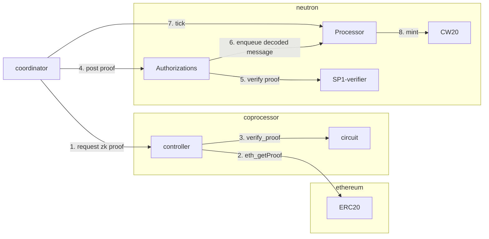

# Valence co-processor app template

This is a template for a Valence co-processor app.

## Overview

This repository showcases a minimal, co-processor enabled Valence Program.

After system is provisioned, a coordinator will generate ZK storage
proofs of a given Ethereum Externally-owned Account (EOA) address for a
selected ERC20 contract address on Ethereum mainnet. The balance
observed during the proving process will be used to mint the equivalent
amount of CW20 tokens on Neutron mainnet for a given address.



> Note: currently the flow is uni-directional in that the proofs are only
> generated for EVM state and verified on Neutron.
>
> We are planning to extend this example with Tendermint proofs being
> verified on EVM in the near future.

### Project filetree

```md
├── apps            # contains the co-processor applications (circuits and controllers).
│   └── ...
├── artifacts       # stores the co-processor builds and on-chain deployment artifacts
│   └── ...
├── Cargo.nix       # defines the Nix build for the Rust workspace
├── Cargo.toml      # main Cargo manifest for the workspace
├── common          # crate with common utilities and definitions
│   └── ...
├── coordinator     # coordinator service that orchestrates the runtime
│   └── ...
├── flake.nix       # nix flake that defines the development environment and builds
├── provisioner     # provisioner service that prepares the system for runtime
│   └── ...
└── valence.toml    # path layouts and other information relevant during the builds
```

## System environment setup

System environment setup involves configuring your on-chain signing capabilities
and preparing your development environment for building and runtime.

Outlined below is the fastest way to run each part of the coprocessor-app.
If you wish to delve deeper into the system environment setup, take a look
at the [environment setup docs](docs/environment.md).

### Setup for on-chain interactions

In order to submit transactions on-chain, a mnemonic seed phrase is needed.
To configure your mnemonic, run the following command:

```sh
cp .example.env .env
```

Then open the created `.env` file and replace `todo` with your seed phrase.

### Local development environment setup

At this moment we exclusively support nix-based builds.
If you do not have nix package manager available on your system, below are some easy ways to install it:

- [Determinate Systems installer](https://docs.determinate.systems/getting-started/)
- [Nix package manager](https://nixos.org/download/)

> We plan on enabling Docker-based builds in the near future

You can verify the nix installation by running the following command which
should build all co-processor circuits defined in `valence.toml`:

```sh
nix run
```

The same command will be invoked during the provisioning run outlined below.

## Provisioning

Multiple steps are involved in getting the system to the point where
the on-and-off-chain components are tied together and ready to start
processing the requests as expected.

System setup is managed by the **provisioner**.

End to end provisioning can be performed with the following command:

```sh
RUST_LOG=info cargo run --bin provisioner
```

To see more details about Valence co-processor app provisioning and
what steps are involved in the e2e provisioning (above), see the
[setup docs](docs/setup.md).

## Runtime

After the system is fully bootstrapped, it is ready to enter the
runtime phase.

Program runtime is managed by the **coordinator** and can be started
by running the following command:

```sh
RUST_LOG=info cargo run --bin coordinator
```

To see more details about the coordinator runtime and overview, see
the [coordinator docs](docs/coordinator.md).
