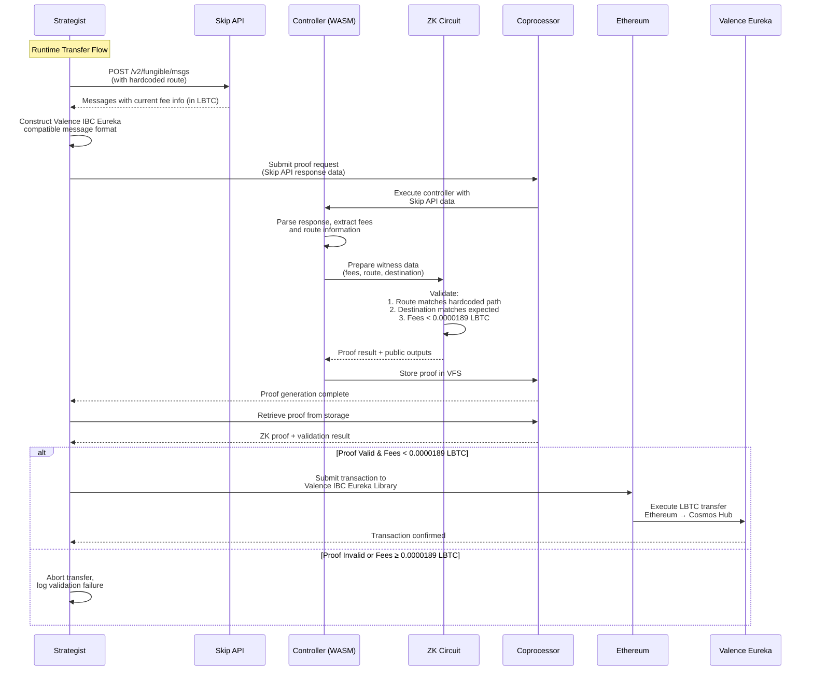

# LBTC Cross-Chain Transfer Architecture with ZK Proof Validation

## System Overview

This system enables secure, validated LBTC transfers from Ethereum to Cosmos Hub using Skip Protocol's IBC Eureka infrastructure with ZK proof validation. The architecture ensures that transfer routes and fees meet predetermined criteria before execution.

## Core Components

### 1. Strategist Crate (`crates/strategist/`)
**Purpose:** Off-chain service that orchestrates the cross-chain transfer workflow

**Responsibilities:**
- Fetches real-time fee information from Skip API
- Constructs Valence IBC Eureka-compatible messages  
- Requests ZK proof generation from coprocessor
- Submits validated transactions to Ethereum

**Client Dependencies:**
- **CoprocessorClient:** From `valence-domain-clients` for ZK proof generation and storage retrieval
- **EthereumClient:** From `valence-domain-clients` for Ethereum transaction submission and signing
- **HTTP Client:** For Skip API integration (reqwest/similar)

### 2. Controller Crate (`crates/controller/`)
**Purpose:** WASM-compiled controller for ZK coprocessor

**Responsibilities:**
- Receives Skip API response data from strategist
- Validates message structure and extracts fee information
- Prepares witness data for ZK circuit verification
- Handles proof results and storage

### 3. Circuit Crate (`crates/circuit/`)
**Purpose:** ZK circuit that validates transfer parameters

**Verification Logic:**
- Proves route matches hardcoded LBTC Ethereum → Cosmos Hub path
- Proves destination address matches expected recipient
- Proves total fees are less than 0.0000189 LBTC ($2.00 equivalent) threshold
- Outputs validation result as public data

### 4. Domain Crate (`crates/domain/`)
**Purpose:** Not required for this application

**Note:** This application does not require blockchain state verification. All necessary data is either:
- **Known in advance:** Route and destination address (hardcoded)
- **Provided as witness:** Skip API response messages and fee information

## Client Integration Architecture

### Valence Domain Clients Integration

The strategist uses production-grade client implementations from `valence-domain-clients`:

```rust
use valence_domain_clients::clients::{CoprocessorClient, EthereumClient};
use valence_domain_clients::coprocessor::base_client::CoprocessorBaseClient;
use valence_domain_clients::evm::base_client::EvmBaseClient;

pub struct LBTCTransferStrategist {
    coprocessor: CoprocessorClient,
    ethereum: EthereumClient,
    controller_id: String,
    skip_client: reqwest::Client,
}
```

### Client Responsibilities

#### CoprocessorClient
- **Proof Generation:** `prove()` method for ZK proof creation
- **Storage Retrieval:** `get_storage_file()` for validation results
- **Development/Production:** Supports both local and public coprocessor services

#### EthereumClient  
- **Transaction Submission:** `sign_and_send()` with automatic gas/nonce management
- **Mnemonic Signing:** BIP39-based transaction signing
- **Query Interface:** Contract interaction for Valence IBC Eureka library

### Environment Configuration

**Development Mode:**
```rust
let coprocessor = CoprocessorClient::local(); // localhost:37281
let ethereum = EthereumClient::new("http://127.0.0.1:8545", mnemonic, None)?; // Anvil
```

**Production Mode:**
```rust
let coprocessor = CoprocessorClient::default(); // Public coprocessor service
let ethereum = EthereumClient::new("https://mainnet.infura.io/v3/api-key", mnemonic, None)?;
```

## Hardcoded Configuration

### Route Parameters
- **Source Chain:** Ethereum (chain_id: 1)
- **Destination Chain:** Cosmos Hub (chain_id: cosmoshub-4)
- **Token:** LBTC (contract address to be determined from Skip API)
- **Destination Address:** `cosmos1...` (dummy address for testing)

### Validation Thresholds
- **Maximum Fee:** 0.0000189 LBTC ($2.00 USD equivalent)
- **Route Validation:** Exact path matching (no intermediate hops allowed)

## Data Sources

### Static Data (Hardcoded in Circuit)
1. **Expected Route:** Complete route structure from development-time Skip API call
2. **Destination Address:** Target Cosmos Hub address for LBTC transfers
3. **Fee Threshold:** Maximum allowable fee in LBTC (0.0000189 LBTC)

### Witness Data (Runtime from Skip API)
1. **Skip API Response:** Complete `/v2/fungible/msgs` response
2. **Current Fee Information:** Real-time fee calculations in LBTC
3. **Message Structure:** Formatted messages for Valence IBC Eureka

## System Flow

### Phase 1: Development Setup (One-time)
1. Manual Skip API route discovery call to `/v2/fungible/route`
2. Extract and hardcode route information into circuit
3. Configure destination address in circuit public inputs

### Phase 2: Runtime Operation (Per Transfer)



## API Integration Specifications

### Skip API Endpoints

#### Route Discovery (Development Phase)
```bash
POST https://api.skip.build/v2/fungible/route
{
  "source_asset_denom": "LBTC_CONTRACT_ADDRESS",
  "source_asset_chain_id": "1",
  "dest_asset_denom": "uatom",
  "dest_asset_chain_id": "cosmoshub-4",
  "amount_in": "1000000",
  "allow_multi_tx": true,
  "allow_unsafe": false,
  "experimental_features": ["eureka"]
}
```

#### Message Construction (Runtime)
```bash
POST https://api.skip.build/v2/fungible/msgs
{
  "source_asset_denom": "LBTC_CONTRACT_ADDRESS",
  "source_asset_chain_id": "1",
  "dest_asset_denom": "uatom", 
  "dest_asset_chain_id": "cosmoshub-4",
  "amount_in": "TRANSFER_AMOUNT",
  "address_list": ["HARDCODED_COSMOS_ADDRESS"],
  "route": "HARDCODED_ROUTE_FROM_PHASE1"
}
```

## ZK Circuit Validation Logic

### Public Inputs (Hardcoded)
1. **Expected Route Hash:** `keccak256(hardcoded_route_data)`
2. **Expected Destination:** `cosmos1...` (hardcoded address)
3. **Fee Threshold:** `1890000000000000` (0.0000189 LBTC in wei, $2.00 equivalent)

### Private Witnesses (From Skip API)
1. **Skip API Response:** Complete message data from `/v2/fungible/msgs`
2. **Extracted Fee Data:** Parsed fee amounts in LBTC (atomic units)
3. **Route Data:** Extracted route information for validation

### Assertions
```rust
// Pseudo-code for circuit logic
assert_eq!(hash(witness.route), public_inputs.expected_route_hash);
assert_eq!(witness.destination, public_inputs.expected_destination);
assert!(witness.total_fees_LBTC_wei < public_inputs.fee_threshold_LBTC_wei);
```

## Data Structures

### Strategist Input
```json
{
  "transfer_amount": "1000000",
  "recipient_address": "cosmos1...",
  "max_fee_LBTC": "0.0000189"
}
```

### Controller Witness Data
```json
{
  "skip_response": {
    "msgs": [...],
    "route": {...},
    "fees": {...}
  },
  "extracted_fees_LBTC_wei": "1250000000000000",
  "destination_address": "cosmos1...",
  "route_hash": "0x..."
}
```

### Circuit Public Output
```json
{
  "validation_passed": true,
  "route_valid": true,
  "destination_valid": true,
  "fees_within_limit": true,
  "total_fees_LBTC": "0.0000125"
}
```

## Implementation Steps

### Step 1: Route Discovery & Hardcoding
- [ ] Make manual Skip API `/route` call for LBTC Ethereum → Cosmos Hub
- [ ] Extract route information and hardcode into circuit
- [ ] Define dummy Cosmos Hub address for testing

### Step 2: Strategist Crate Development
- [ ] Create `crates/strategist/` with `valence-domain-clients` dependency
- [ ] Initialize `CoprocessorClient` and `EthereumClient` 
- [ ] Implement Skip API client with `reqwest`
- [ ] Implement `/msgs` endpoint integration
- [ ] Add Valence IBC Eureka message formatting
- [ ] Implement coprocessor proof request workflow using `CoprocessorBaseClient` trait

### Step 3: Controller Enhancement  
- [ ] Modify `get_witnesses()` to parse Skip API responses
- [ ] Add fee extraction and validation logic (LBTC denomination)
- [ ] Implement route verification against hardcoded data

### Step 4: Circuit Implementation
- [ ] Replace increment logic with transfer validation
- [ ] Add route hash verification
- [ ] Add destination address validation  
- [ ] Add LBTC fee threshold checking (0.0000189 LBTC)
- [ ] Output comprehensive validation results

### Step 5: Integration & Testing
- [ ] End-to-end testing with mock Skip API responses
- [ ] Proof generation and verification testing using local coprocessor
- [ ] Ethereum transaction submission testing using Anvil
- [ ] Error handling and edge case validation

## Dependencies

### Strategist Crate Dependencies
```toml
[dependencies]
# Valence domain clients for coprocessor and Ethereum interaction
valence-domain-clients = { git = "https://github.com/timewave-computer/valence-domain-clients" }

# HTTP client for Skip API calls
reqwest = { version = "0.11", features = ["json"] }
tokio = { version = "1.0", features = ["full"] }

# JSON handling
serde = { version = "1.0", features = ["derive"] }
serde_json = "1.0"

# Error handling
anyhow = "1.0"
thiserror = "1.0"

# Logging
log = "0.4"
env_logger = "0.10"
```

## Conditions of Satisfaction

### Functional Requirements
1. **Route Validation:** System MUST verify that Skip API returns the exact hardcoded route
2. **Destination Validation:** System MUST verify destination address matches hardcoded recipient  
3. **Fee Validation:** System MUST verify total fees are less than 0.0000189 LBTC ($2.00 equivalent)
4. **Proof Generation:** System MUST generate valid ZK proof for all validations
5. **Transaction Execution:** System MUST only submit transactions when all validations pass

### Security Requirements
1. **Route Immutability:** Hardcoded route data cannot be modified at runtime
2. **Fee Accuracy:** Fee calculations must be precise to prevent economic attacks
3. **Proof Integrity:** ZK proofs must be cryptographically sound and verifiable
4. **Input Validation:** All external inputs must be sanitized and validated

### Performance Requirements
1. **Proof Generation:** < 30 seconds for proof generation
2. **API Response Time:** < 5 seconds for Skip API calls
3. **Transaction Submission:** < 60 seconds end-to-end flow

### Error Handling
1. **Skip API Failures:** Graceful degradation when Skip API is unavailable
2. **Proof Failures:** Clear error messages when validation fails
3. **Fee Threshold Breaches:** Immediate abort when fees exceed 0.0000189 LBTC
4. **Network Issues:** Retry logic for transient failures

## Success Metrics
- **Validation Accuracy:** 100% correct validation of route, destination, and fees
- **Security:** Zero successful bypasses of validation logic
- **Cost Efficiency:** Average fees < 0.000015 LBTC per transfer (well below 0.0000189 LBTC threshold)