# LBTC Cross-Chain Transfer Architecture with ZK Proof Validation

## System Overview

This system enables secure, validated LBTC transfers from Ethereum to Cosmos Hub using Skip Protocol's IBC Eureka infrastructure with ZK proof validation. The architecture ensures that transfer routes and fees meet predetermined criteria before execution through the Valence Authorization contract ecosystem.

## Core Components

### 1. Strategist Crate (`crates/strategist/`)
**Purpose:** Off-chain service that orchestrates the cross-chain transfer workflow

**Responsibilities:**
- Fetches real-time fee information from Skip API
- Constructs transfer request data for ZK validation
- Requests ZK proof generation from coprocessor (outputs Valence ZkMessage)
- Submits validated ZkMessage to Valence Authorization contract

**Client Dependencies:**
- **CoprocessorClient:** From `valence-domain-clients` for ZK proof generation and storage retrieval
- **EthereumClient:** From `valence-domain-clients` for Ethereum transaction submission and signing
- **HTTP Client:** For Skip API integration (reqwest/similar)

### 2. Controller Crate (`crates/controller/`)
**Purpose:** WASM-compiled controller for ZK coprocessor

**Responsibilities:**
- Receives Skip API response data from strategist
- Validates message structure and extracts fee information
- Prepares witness data for ZK circuit verification
- Handles proof results and storage

### 3. Circuit Crate (`crates/circuit/`)
**Purpose:** ZK circuit that validates transfer parameters and generates Valence ZkMessage

**Verification Logic:**
- Proves route matches hardcoded LBTC Ethereum → Cosmos Hub path
- Proves destination address matches expected recipient
- Proves total fees are less than 0.0000189 LBTC ($2.00 equivalent) threshold
- **Proves IBC Eureka memo is empty** (security requirement)
- **Generates ABI-encoded ZkMessage** containing validated IBCEurekaTransfer call

**Output:** Complete Valence ecosystem integration message ready for Authorization contract

### 4. Domain Crate (`crates/domain/`)
**Purpose:** Not required for this application

**Note:** This application does not require blockchain state verification. All necessary data is either:
- **Known in advance:** Route and destination address (hardcoded)
- **Provided as witness:** Skip API response messages and fee information

## Valence Integration Architecture

### ZkMessage Structure (Circuit Output)

Our circuit generates an ABI-encoded ZkMessage for the Valence Authorization contract:

```rust
// From Authorization.sol
struct ZkMessage {
    uint64 registry;                    // ID to identify this message type (LBTC transfers)
    uint64 blockNumber;                 // Current block number
    address authorizationContract;      // Authorization contract address (or address(0))
    ProcessorMessage processorMessage;  // The actual transfer message
}
```

### ProcessorMessage Structure

```rust
struct ProcessorMessage {
    ProcessorMessageType messageType;   // SendMsgs (immediate execution)
    bytes message;                      // ABI-encoded SendMsgs struct
}

struct SendMsgs {
    uint64 executionId;                 // Unique execution identifier
    Priority priority;                  // Medium priority
    Subroutine subroutine;             // AtomicSubroutine with transfer function
    uint64 expirationTime;             // 0 (no expiration)
    bytes[] messages;                   // ABI-encoded transfer call
}
```

### Transfer Execution Structure

```rust
struct AtomicSubroutine {
    AtomicFunction[] functions;         // Single function: IBCEurekaTransfer contract
    RetryLogic retryLogic;             // NoRetry configuration
}

struct AtomicFunction {
    address contractAddress;            // IBCEurekaTransfer library address
}

// Transfer call with validated parameters
function transfer(Fees calldata fees, string calldata memo) external;

struct Fees {
    uint256 relayFee;                  // Validated fee from Skip API (< 0.0000189 LBTC)
    address relayFeeRecipient;         // Fee recipient address
    uint64 quoteExpiry;                // Quote expiration timestamp
}

// Security: memo parameter MUST be empty string - validated in circuit
// This prevents unauthorized execution of arbitrary logic on destination chain
```

## Client Integration Architecture

### Valence Domain Clients Integration

The strategist uses production-grade client implementations from `valence-domain-clients`:

```rust
use valence_domain_clients::clients::{CoprocessorClient, EthereumClient};
use valence_domain_clients::coprocessor::base_client::CoprocessorBaseClient;
use valence_domain_clients::evm::base_client::EvmBaseClient;

pub struct LBTCTransferStrategist {
    coprocessor: CoprocessorClient,
    ethereum: EthereumClient,
    controller_id: String,
    skip_client: reqwest::Client,
}
```

### Client Responsibilities

#### CoprocessorClient
- **Proof Generation:** `prove()` method for ZK proof creation (returns ZkMessage)
- **Storage Retrieval:** `get_storage_file()` for validation results
- **Development/Production:** Supports both local and public coprocessor services

#### EthereumClient  
- **Transaction Submission:** `sign_and_send()` to Valence Authorization contract
- **Mnemonic Signing:** BIP39-based transaction signing
- **Query Interface:** Contract interaction for Authorization and IBCEurekaTransfer

### Environment Configuration

**Development Mode:**
```rust
let coprocessor = CoprocessorClient::local(); // localhost:37281
let ethereum = EthereumClient::new("http://127.0.0.1:8545", mnemonic, None)?; // Anvil
```

**Production Mode:**
```rust
let coprocessor = CoprocessorClient::default(); // Public coprocessor service
let ethereum = EthereumClient::new("https://mainnet.infura.io/v3/api-key", mnemonic, None)?;
```

## Hardcoded Configuration

### Route Parameters
- **Source Chain:** Ethereum (chain_id: 1)
- **Destination Chain:** Cosmos Hub (chain_id: cosmoshub-4)
- **Token:** LBTC (contract: `0x8236a87084f8B84306f72007F36F2618A5634494`)
- **Destination Address:** `cosmos1zxj6y5h3r8k9v7n2m4l1q8w5e3t6y9u0i7o4p2s5d8f6g3h1j4k7l9n2`
- **IBCEurekaTransfer Contract:** `0xFc2d0487A0ae42ae7329a80dc269916A9184cF7C`

### Validation Thresholds
- **Maximum Fee:** 0.0000189 LBTC ($2.00 USD equivalent)
- **Route Validation:** Exact EUREKA bridge path matching

## Data Sources

### Static Data (Hardcoded in Circuit)
1. **Expected Route:** Complete route structure with EUREKA bridge verification
2. **Destination Address:** Target Cosmos Hub address for LBTC transfers
3. **Fee Threshold:** Maximum allowable fee in LBTC (1890000000000000 wei)
4. **IBCEurekaTransfer Address:** Contract address for transfer execution

### Witness Data (Runtime from Skip API)
1. **Skip API Response:** Complete `/v2/fungible/msgs` response
2. **Current Fee Information:** Real-time fee calculations in LBTC
3. **Route Validation Data:** EUREKA bridge operation details

## System Flow

### Phase 1: Development Setup (One-time)
1. Manual Skip API route discovery call to `/v2/fungible/route`
2. Extract and hardcode route information into circuit
3. Configure destination address and IBCEurekaTransfer contract in circuit

### Phase 2: Runtime Operation (Per Transfer)

```mermaid
sequenceDiagram
    participant S as Strategist
    participant SA as Skip API
    participant C as Controller (WASM)
    participant ZK as ZK Circuit
    participant CP as Coprocessor
    participant E as Ethereum
    participant VA as Valence Authorization
    participant VE as IBCEurekaTransfer

    Note over S: Runtime Transfer Flow
    
    S->>SA: POST /v2/fungible/msgs<br/>(with hardcoded route)
    SA-->>S: Messages with current fee info (in LBTC)
    
    S->>CP: Submit proof request<br/>(Skip API response + transfer params)
    CP->>C: Execute controller with<br/>Skip API data
    C->>C: Parse response, extract fees<br/>and route information
    C->>ZK: Prepare witness data<br/>(fees, route, destination)
    ZK->>ZK: Validate:<br/>1. Route matches EUREKA bridge<br/>2. Destination matches expected<br/>3. Fees < 0.0000189 LBTC
    ZK->>ZK: Generate ABI-encoded ZkMessage<br/>with IBCEurekaTransfer call
    ZK-->>C: ZkMessage proof + validation result
    C->>CP: Store ZkMessage in VFS
    CP-->>S: Proof generation complete
    
    S->>CP: Retrieve ZkMessage from storage
    CP-->>S: ABI-encoded ZkMessage + validation result
    
    alt Validation Passed & Fees < 0.0000189 LBTC
        S->>E: Submit ZkMessage to<br/>Valence Authorization contract
        E->>VA: Process ZkMessage with<br/>ZK proof verification
        VA->>VA: Verify proof and decode<br/>ProcessorMessage
        VA->>VE: Execute transfer(fees, memo)<br/>via processor
        VE->>VE: Execute LBTC transfer<br/>Ethereum → Cosmos Hub
        VE-->>S: Transfer completed
    else Validation Failed or Fees ≥ 0.0000189 LBTC
        S->>S: Abort transfer,<br/>log validation failure
    end
```



## API Integration Specifications

### Skip API Endpoints

#### Route Discovery (Development Phase)
```bash
POST https://api.skip.build/v2/fungible/route
{
  "source_asset_denom": "0x8236a87084f8B84306f72007F36F2618A5634494",
  "source_asset_chain_id": "1",
  "dest_asset_denom": "ibc/DBD9E339E1B093A052D76BECFFDE8435EAC114CF2133346B4D691F3F2068C957",
  "dest_asset_chain_id": "cosmoshub-4",
  "amount_in": "1000000",
  "allow_multi_tx": true,
  "allow_unsafe": false,
  "experimental_features": ["eureka"]
}
```

#### Message Construction (Runtime)
```bash
POST https://api.skip.build/v2/fungible/msgs
{
  "source_asset_denom": "0x8236a87084f8B84306f72007F36F2618A5634494",
  "source_asset_chain_id": "1",
  "dest_asset_denom": "ibc/DBD9E339E1B093A052D76BECFFDE8435EAC114CF2133346B4D691F3F2068C957", 
  "dest_asset_chain_id": "cosmoshub-4",
  "amount_in": "TRANSFER_AMOUNT",
  "address_list": ["0x...", "cosmos1zxj6y5h3r8k9v7n2m4l1q8w5e3t6y9u0i7o4p2s5d8f6g3h1j4k7l9n2"]
}
```

## ZK Circuit Validation Logic

### Public Inputs (Hardcoded)
1. **Expected Route Hash:** `a041afeb1546e275ec0038183732036ce653b197e8129748da95cf6c7de43abf`
2. **Expected Destination:** `cosmos1zxj6y5h3r8k9v7n2m4l1q8w5e3t6y9u0i7o4p2s5d8f6g3h1j4k7l9n2`
3. **Fee Threshold:** `1890000000000000` (0.0000189 LBTC in wei, $2.00 equivalent)
4. **IBCEurekaTransfer Address:** `0xFc2d0487A0ae42ae7329a80dc269916A9184cF7C`
5. **Expected Memo:** `""` (empty string - security requirement)

### Private Witnesses (From Skip API)
1. **Skip API Response:** Complete message data from `/v2/fungible/msgs`
2. **Extracted Fee Data:** Parsed fee amounts in LBTC (atomic units)
3. **Route Data:** EUREKA bridge operation validation

### Circuit Output: ABI-Encoded ZkMessage
```rust
// Pseudo-code for circuit logic
assert_eq!(validate_route_components(witness.route), true);
assert_eq!(witness.destination, public_inputs.expected_destination);
assert!(witness.total_fees_LBTC_wei < public_inputs.fee_threshold_LBTC_wei);
assert_eq!(witness.memo, public_inputs.expected_memo);  // Must be empty

// Generate Valence ZkMessage
let fees = Fees {
    relayFee: witness.total_fees_LBTC_wei,
    relayFeeRecipient: witness.fee_recipient,
    quoteExpiry: witness.quote_expiry,
};

let transfer_call = abi.encode_call("transfer", [fees, ""]);  // Empty memo enforced

let atomic_function = AtomicFunction {
    contractAddress: public_inputs.eureka_transfer_address,
};

let atomic_subroutine = AtomicSubroutine {
    functions: [atomic_function],
    retryLogic: RetryLogic::NoRetry,
};

let send_msgs = SendMsgs {
    executionId: generate_execution_id(),
    priority: Priority::Medium,
    subroutine: abi.encode(atomic_subroutine),
    expirationTime: 0,
    messages: [transfer_call],
};

let processor_message = ProcessorMessage {
    messageType: ProcessorMessageType::SendMsgs,
    message: abi.encode(send_msgs),
};

let zk_message = ZkMessage {
    registry: LBTC_TRANSFER_REGISTRY_ID,
    blockNumber: current_block(),
    authorizationContract: address(0),  // Valid for any contract
    processorMessage: processor_message,
};

return abi.encode(zk_message);
```

## Data Structures

### Strategist Input
```json
{
  "transfer_amount": "1000000",
  "recipient_address": "cosmos1zxj6y5h3r8k9v7n2m4l1q8w5e3t6y9u0i7o4p2s5d8f6g3h1j4k7l9n2",
  "max_fee_LBTC": "0.0000189"
}
```

### Controller Witness Data
```json
{
  "skip_response": {
    "operations": [
      {
        "type": "eureka_transfer",
        "bridge_id": "EUREKA",
        "entry_contract_address": "0xFc2d0487A0ae42ae7329a80dc269916A9184cF7C"
      }
    ],
    "estimated_fees": [
      {
        "amount": "957",
        "chain_id": "1"
      }
    ]
  },
  "destination": "cosmos1zxj6y5h3r8k9v7n2m4l1q8w5e3t6y9u0i7o4p2s5d8f6g3h1j4k7l9n2"
}
```

### Circuit Public Output: ABI-Encoded ZkMessage
```rust
// Returned as binary data ready for Valence Authorization contract
pub struct ZkMessageOutput {
    pub registry: u64,                     // LBTC transfer registry ID
    pub block_number: u64,                 // Current block number
    pub authorization_contract: [u8; 20],  // address(0) for permissionless
    pub processor_message: Vec<u8>,        // ABI-encoded ProcessorMessage
}
```

## Implementation Steps

### Step 1: Route Discovery & Hardcoding ✅
- [x] Make manual Skip API `/route` call for LBTC Ethereum → Cosmos Hub
- [x] Extract route information and hardcode into circuit
- [x] Define Cosmos Hub address and IBCEurekaTransfer contract

### Step 2: Strategist Crate Development ✅
- [x] Create `crates/strategist/` with client abstractions
- [x] Implement Skip API client with `reqwest`
- [x] Implement `/msgs` endpoint integration
- [x] Add coprocessor proof request workflow

### Step 3: Controller Enhancement ✅
- [x] Modify `get_witnesses()` to parse Skip API responses
- [x] Add fee extraction and validation logic (LBTC denomination)
- [x] Implement route verification against hardcoded data

### Step 4: Circuit Implementation ✅
- [x] Replace increment logic with transfer validation
- [x] Add route component verification (EUREKA bridge)
- [x] Add destination address validation  
- [x] Add LBTC fee threshold checking (0.0000189 LBTC)
- [x] Add memo validation (must be empty string)
- [x] Output comprehensive validation results

### Step 5: Valence Integration (Next Phase)
- [ ] Add alloy-sol-types dependency for ABI encoding
- [ ] Implement ZkMessage structure generation in circuit
- [ ] Add ProcessorMessage and SendMsgs construction
- [ ] Add AtomicSubroutine with IBCEurekaTransfer call
- [ ] Add transfer(fees, memo) function encoding with empty memo enforcement
- [ ] Test ABI encoding compatibility with Valence contracts

### Step 6: Integration & Testing ✅
- [x] End-to-end testing with mock Skip API responses
- [x] Proof generation and verification testing
- [x] Error handling and edge case validation

## Dependencies

### Enhanced Circuit Dependencies (for Valence Integration)
```toml
[dependencies]
# Existing dependencies
valence-coprocessor = { git = "https://github.com/timewave-computer/valence-coprocessor.git", tag = "v0.2.1" }

# New: Solidity ABI encoding for ZkMessage generation
alloy-sol-types = "0.7"
alloy-primitives = "0.7"

# Existing
anyhow = "1.0"
```

### Strategist Crate Dependencies
```toml
[dependencies]
# Valence domain clients for coprocessor and Ethereum interaction
valence-domain-clients = { git = "https://github.com/timewave-computer/valence-domain-clients" }

# HTTP client for Skip API calls
reqwest = { version = "0.11", features = ["json"] }
tokio = { version = "1.0", features = ["full"] }

# JSON handling
serde = { version = "1.0", features = ["derive"] }
serde_json = "1.0"

# Error handling
anyhow = "1.0"
thiserror = "1.0"

# Logging
tracing = "0.1"
```

## Conditions of Satisfaction

### Functional Requirements
1. **Route Validation:** System MUST verify that Skip API returns EUREKA bridge operations
2. **Destination Validation:** System MUST verify destination address matches hardcoded recipient  
3. **Fee Validation:** System MUST verify total fees are less than 0.0000189 LBTC ($2.00 equivalent)
4. **Memo Validation:** System MUST verify IBC Eureka memo is empty string (security requirement)
5. **ZkMessage Generation:** System MUST generate valid ABI-encoded ZkMessage for Valence Authorization
6. **Proof Verification:** Valence Authorization MUST successfully verify and execute the ZkMessage

### Security Requirements
1. **Route Immutability:** Hardcoded route data cannot be modified at runtime
2. **Fee Accuracy:** Fee calculations must be precise to prevent economic attacks
3. **Proof Integrity:** ZK proofs must be cryptographically sound and verifiable by Valence
4. **Input Validation:** All external inputs must be sanitized and validated
5. **Message Integrity:** ABI-encoded messages must be tamper-proof and valid
6. **Memo Security:** IBC Eureka memo must be empty to prevent unauthorized execution logic

### Performance Requirements
1. **Proof Generation:** < 30 seconds for ZkMessage proof generation
2. **API Response Time:** < 5 seconds for Skip API calls
3. **Transaction Submission:** < 60 seconds end-to-end flow through Valence

### Error Handling
1. **Skip API Failures:** Graceful degradation when Skip API is unavailable
2. **Proof Failures:** Clear error messages when validation fails
3. **Fee Threshold Breaches:** Immediate abort when fees exceed 0.0000189 LBTC
4. **ABI Encoding Errors:** Proper error handling for malformed ZkMessage generation

## Success Metrics
- **Validation Accuracy:** 100% correct validation of route, destination, and fees
- **Security:** Zero successful bypasses of validation logic
- **Valence Integration:** 100% successful ZkMessage verification and execution
- **Cost Efficiency:** Average fees < 0.000015 LBTC per transfer (well below 0.0000189 LBTC threshold)