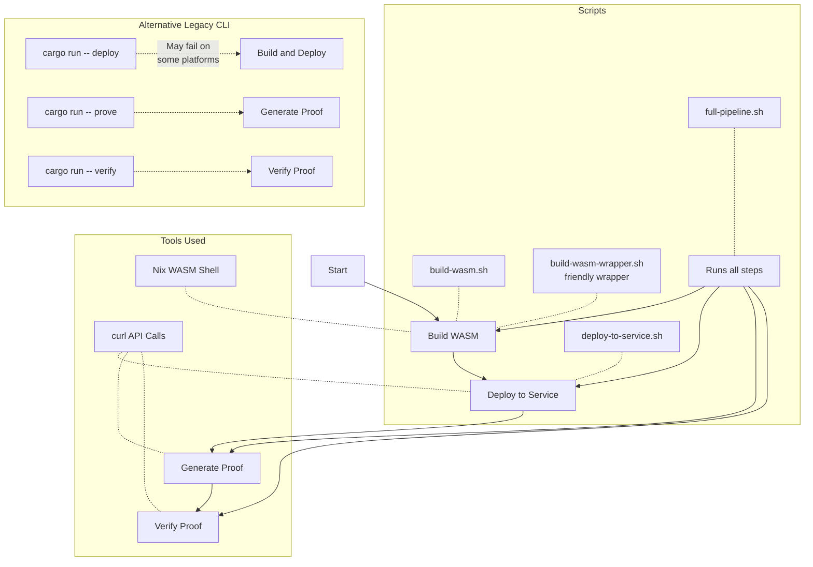

# Valence Coprocessor App Workflow

This document explains the workflow for building, deploying, and using the Valence coprocessor application.

## Workflow Diagram



## Script Functionality

| Script | Purpose | Description |
|--------|---------|-------------|
| `build-wasm.sh` | Build WASM | Builds the WASM binary using Nix wasm-shell |
| `build-wasm-wrapper.sh` | User-friendly wrapper | A more user-friendly wrapper around build-wasm.sh |
| `deploy-to-service.sh` | Deploy to service | Deploys the WASM binary to the co-processor service |
| `full-pipeline.sh` | Complete workflow | Runs the entire pipeline from build to verification |
| `install-cargo-prove.sh` | Install cargo-prove | Utility to install the cargo-prove binary |

## Recommended Usage

For most users, especially on macOS with Apple Silicon, we recommend using our shell scripts rather than the legacy Cargo CLI:

```bash
# Run the entire pipeline with one command
./scripts/full-pipeline.sh

# Or run each step individually
./scripts/build-wasm.sh
./scripts/deploy-to-service.sh
# Then use curl for proof generation and verification
``` 